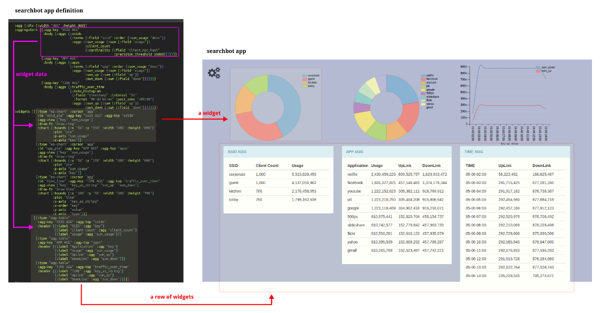
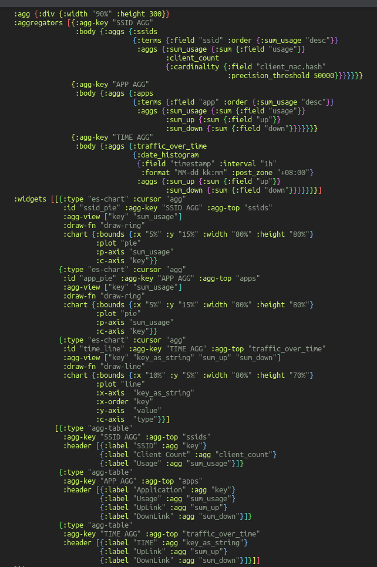

# searchbot

Searchbot for ElasticSearch





## Development

Enter Clojure REPL `lein repl`

```clojure
(run)
(browser-repl)
```

In the REPL, type

```clojure
(ns searchbot.core)
(swap! app-state assoc :text "Interactivity FTW")
```

## Running with Foreman

``` sh
lein with-profile -dev,+production uberjar && foreman start
```

Now your app is running at
[http://localhost:5000](http://localhost:5000) in production mode.

## License

Copyright © 2015 FIXME

Distributed under the Eclipse Public License either version 1.0 or (at
your option) any later version.

## Chestnut

Created with [Chestnut](http://plexus.github.io/chestnut/) 0.7.0.
