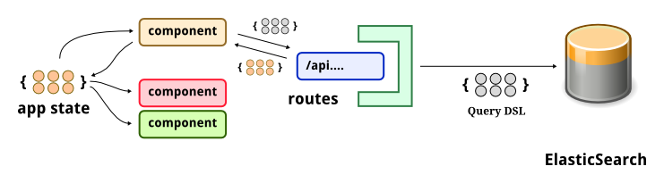

# searchbot

## A little bit of background
Hi, there. I hope enjoy working with [ElasticSearch](https://www.elastic.co/products/elasticsearch) as I do. ElasticSearch is a wonderful tool for most data analysis and aggregations problems. On top of ElasticSearch, [Kibana](https://www.elastic.co/products/kibana) helps to explore data indexed in ElasticSearch, with handy widgets and settings for time-based data.

When you go beyond data exploration or start to development product features around ElasticSearch, you may find Kibana falls short of providing more advanced queries and aggregations. That's time to build customized UI widgets for your own dashboard, and it's also what motivates me to build **searchbot**.

## Concept
A data-driven prototyping engine for dashboards based on ElasticSearch




## Dashboard Definition


## Development

Enter Clojure REPL `lein repl`

```clojure
(run)
(browser-repl)
```

In the REPL, type

```clojure
(ns searchbot.core)
(swap! app-state assoc :text "Interactivity FTW")
```

## Running with Foreman

``` sh
lein with-profile -dev,+production uberjar && foreman start
```

Now your app is running at
[http://localhost:5000](http://localhost:5000) in production mode.


## Chestnut

- Created with [Chestnut](http://plexus.github.io/chestnut/) 0.7.0.
- Updated with [Chestnut](http://plexus.github.io/chestnut/) 0.8.1 (90e701e0).
